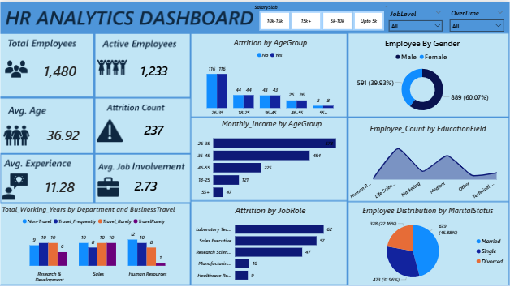

# CodeAlpha-HR-ANALYTICS

## Project Overview
This project presents an interactive HR Analytics Dashboard developed using Microsoft Power BI.The dashboard provides insights into workforce demographics, employee attrition, job roles, education background, business travel, marital status, and other HR-related indicators.

## Project Overview
The objective is to transform HR data into clear and actionable insights that can support workforce monitoring and HR decision-making;
- Analyze total employee population
- Calculate employee attrition rate
- Analyze attrition across age groups
- Identify job roles with higher employee attrition
- Examine employee distribution by gender
- Analyze employee education fields
- Examine marital-status distribution
- Analyze business travel patterns
- Provide interactive HR insights using Power BI

## Business Problem
Organizations need effective ways to monitor their workforce and understand employee attrition. Without a centralized analytical view, it can be difficult to identify patterns across employee demographics, departments, job roles, and other workforce characteristics. This project uses Power BI to provide an interactive dashboard for exploring these HR metrics.

## Key KPIs
- Total Employees: 1,480
- Active Employees: 1,233
- Attrition Count: 237
- Attrition Rate: 16%
- Average Age: 36.92
- Average Experience: 11.28
- Average Job Involvement: 2.73

## Dashboard View

## Workforce Overview
- The dashboard contains 1,480 employees, with an average age of 36.92 years.
- The displayed job-role analysis shows the highest attrition counts among Laboratory      Technicians, Sales Executives, and Research Scientists.
- The workforce consists of approximately 60% male employees and 40% female employees.
- Married employees represent the largest marital-status group, followed by single and     divorced employees.
- Age group of 26-35 represent highest monthly income followed by 36-45.
- Medical in the education field has highest employee count with salary slab of 10k-5k.
- Salaryslab of upto 5k has the highest attrition count.
- Highest attrition count is found among the single.

## Conclusion
This project demonstrates the use of Power BI and DAX to transform HR data into an interactive dashboard for workforce and attrition analysis. The dashboard provides a foundation for exploring employee demographics, job-role patterns, workforce composition, and employee attrition.

## Recommendations for HR Analysis
The dashboard can be used to:
- Monitor employee attrition
- Identify job roles requiring further investigation
- Understand workforce demographics
- Monitor workforce composition
- Support employee retention analysis
- Support HR workforce planning

## Tools & Technologies
-  Data cleaning
-  Microsoft PowerBI
-  DAX
-  KPI development
-  Data modeling/aggregation
-  Business Intelligence
-  Visualization
-  HR analysis
-  Business storytelling.

## Author 
Favour Uchendu
Data Analyst | Power BI | SQL | Python | Data Visualization.
